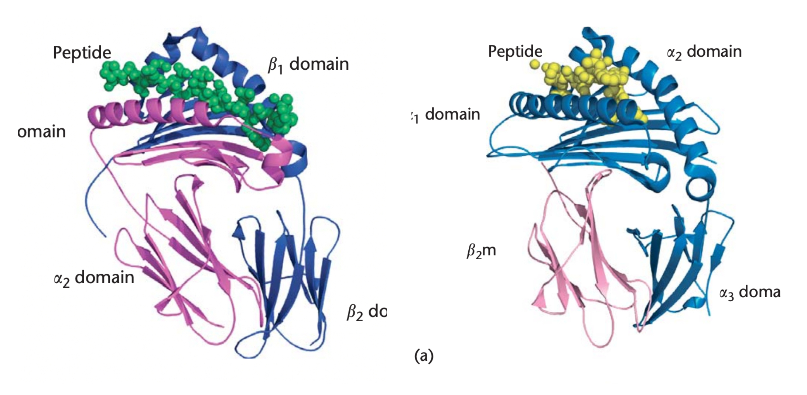

<h3 align="center"><a href="https://www.hse.ru/ba/cmb/students/diplomas/924747369" target="_blank">Выпускная Квалификационная Работа</a></h3>  
<h1 align="center">ПОТЕНЦИАЛЬНАЯ РОЛЬ АЛЛЕЛЕЙ HLA ПРИ ВИРУСНЫХ ИНФЕКЦИЯХ. ВЛИЯНИЕ ГЕНОТИПОВ HLA НА ПРЕЗЕНТАЦИЮ АНТИГЕНОВ 
ПРИ Т - КЛЕТОЧНО-ОПОСРЕДОВАННОМ ИММУННОМ ОТВЕТЕ</h1>

<p align="center">
  
</p>

---  
### Описание:

+ Results –> полученные рисунки и таблицы.
+ Chosen_alleles –> рассмотренные аллели HLA.
+ Tables –> таблицы с найденными коэфициентами презентации для всех сочетаний вирус – аллель HLA.
+ Viral_proteomes –> .fasta - файлы референсных протеомов.

---
### Предполагаемая последовательность действий:
+ Создайте файлы с перечислением _аллелей HLA_ –> **Data/MHC/MHCI.txt** и **Data/MHC/MHCII.txt**
+ Загрузите _fasta-файлы_ протеомов вирусов в директорию **Data/Viral_proteomes**. Описание вирусных белков должно соответствовать стандартам UniProt.
+ Поставьте программы для _расчёта аффинности_ (**netMHCpan** и **netMHCIIpan**) в **/software**. Если далее возникают проблемы, то, вероятно, используется другая версия программы, исправьте путь до файла в Script_4.sh.
+ Проверьте, что все скрипты в _/Scripts_ исполняемы (при необходимости, измените права доступа)
+ Запустите скрипт **Endless\_1\_start.sh**:  
```
screen -S calculating_affinity
# в новом окне
./Endless_1_start.sh | tee -a affcalc.out
```
+ Далее (можно параллельно) запустите **Endless\_processing.sh**:  
```
screen -S processing
# в новом окне
./Endless_processing.sh | tee -a proc.out
```
+ Для визуализации полученных данных следует открыть **Heatmaps\_and\_barplots.ipynb** и следовать указаниям.  

---
### Cкрипты:  
  
файл| описание| входные данные| результат работы
---- | -----------| --------------| --------------
done\_check.sh| Выводит процент просчианных сочетаний аллель-белок вируса, запускается Script\_2.sh|путь до ../Data/Affinity\_results/(Virname) и число пептидов рассматриваемого вируса|   
Endless\_1\_start.sh| Cтарт рассчёта аффинности.  Запускает Script\_1.sh, когда имеются непросчитанные вирусные протеомы| ../Data/Viral_proteomes/ | все сочетания ../Data/Affinity\_results/(Virname)/(Protein)\_(Allele).tsv
Endless\_processing.sh| Старт подсчёта коэф. презентации для вирусов, с просчитанной аффинностью. Запускает Raw\_data\_processing.py| ../Data/Viral_proteomes/Ready/ | все сочетания ../Data/Affinity\_results/Processed/(Virname)\_(I/II).csv; ../Data/Affinity\_results/Processed/human\_like\_peptides.txt
Heatmaps\_and\_barplots.ipynb| Jupyter Notebook для визуализации процессированных данных| ../Data/Affinity\_results/Processed/(Virname)\_(I/II).csv |все картинки сохраняются в ../Output/
num of peptides.py| Вывод числа всех высокоафинных пептидов для конкретного вируса| ../Data/Affinity\_results/Processed/VirName\_(I/II).csv, нужно просто указать название вируса
Raw\_data\_processing.py| Нахождение коэфициентов презентации для конкретного вируса|../Data/Affinity_results/(Virname)/\*; название вируса | сохраняет 2 таблицы ../Data/Affinity\_results/Processed/Virname\_(I/II).csv
Script\_1.sh| Запуск Script\_2.sh для доступных протеомов| ../Data/Viral\_proteomes/ | |
Script\_2.sh| Вычисление аффинности для пептидов вируса| название вируса | ../Data/Affinity\_results/Affinity\_Virname.txt; ../Data/Affinity\_results/Virname/\*
Script\_3.sh| Нарезание вирусных белков на пептиды| файл для разрезания| tmp/Peptides\_(I/II)(Prot\_name)
Script\_4.sh| Запуск netMHCpan| название виуса; название аллеля; ранг сильного связывания; ранг низкого связывания; класс MHC; путь до ../Data/Affinity\_results/Virname.txt| дополняет Affinity\_Virname.txt; ../Data/Affinity\_results/Virname/(Protein)\_MHC.tsv

* fasta - файлы просчитанных вирусов оказываются в Data/Viral\_proteomes/Ready/Ready\_2/

---
Для выполняния скриптов требуется, чтобы были установлены следующие библиотеки python: **numpy, pandas, seaborn, matplotlib, pepmatch, math, argparse**.


